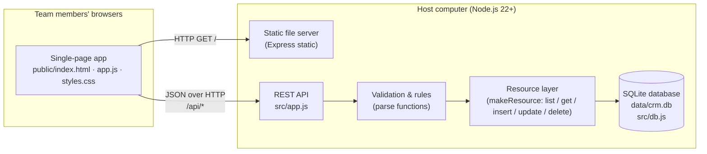
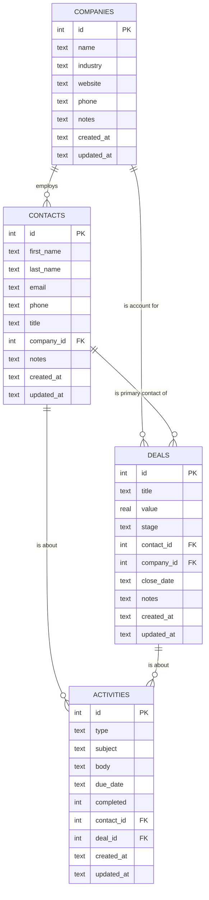
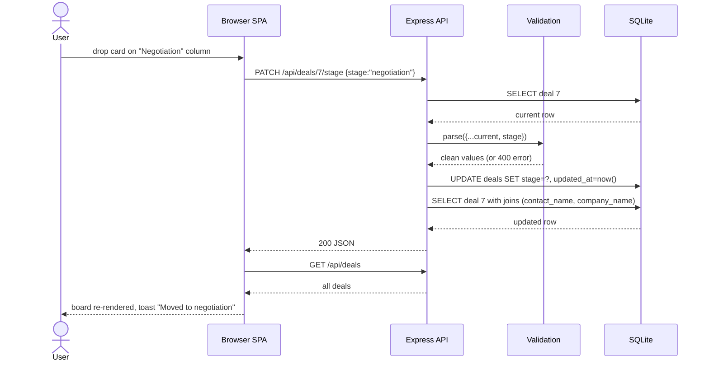
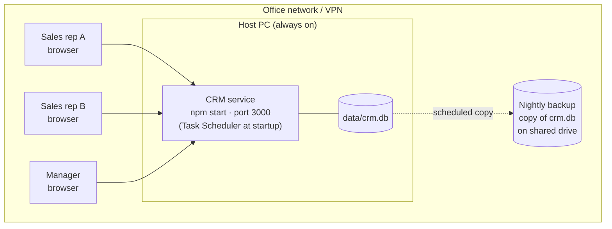
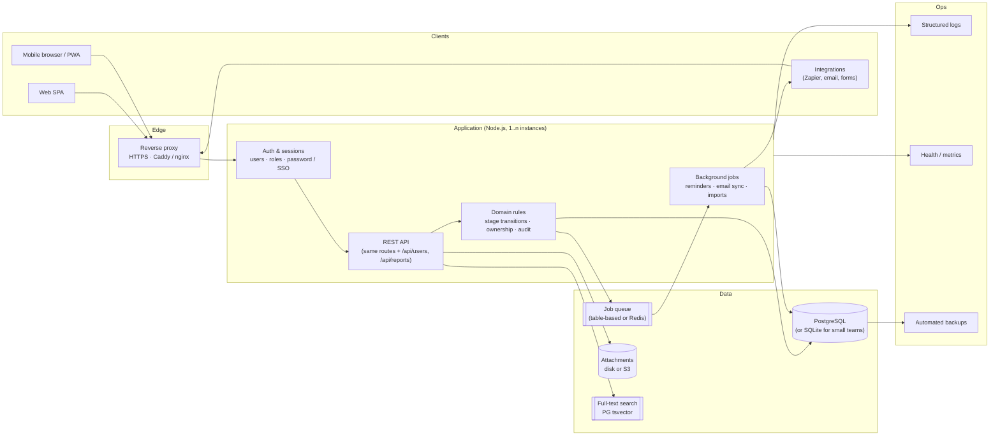

# CRMSales – System Architecture

This document describes the architecture of the sales CRM: what is built today, how the
pieces fit together, and the target architecture for growing it into a multi-user system.

---

## 1. Goals and scope

The CRM helps a sales team track **who** they are talking to (companies, contacts),
**what** they are selling (deals moving through a pipeline), and **what happened**
(activities such as calls, emails, meetings, tasks and notes).

Design principles:

| Principle | What it means here |
|-----------|--------------------|
| Simple to run | One command starts it. No database server, no build step, one dependency. |
| One source of truth | A single database on one host; everyone reads and writes the same data. |
| Thin API, thin UI | The API does all validation and rules; the UI only renders and calls it. |
| Easy to grow | Every layer can be swapped (SQLite → PostgreSQL, vanilla JS → React) without rewriting the others. |

---

## 2. High-level architecture (as built)

**Three layers, one process.** The browser loads the static single-page app, which then talks
only to the JSON API. The API validates every request, applies business rules (valid pipeline
stages, referential checks), and reads/writes SQLite through a small generic resource layer.

### Component responsibilities

| Component | File(s) | Responsibility |
|-----------|---------|----------------|
| SPA (frontend) | `public/` | Hash-routed pages (Dashboard, Deals board, Contacts, Companies, Activities), modal forms, drag-and-drop on the pipeline. Holds no business rules. |
| HTTP server | `src/server.js` | Opens the database, builds the app, listens on `HOST:PORT`, prints the LAN address. |
| API | `src/app.js` | Express routes for each resource, dashboard aggregation, error handling, JSON responses. |
| Validation | `parse()` in `src/app.js` | Normalises input, enforces required fields, formats (email, dates), enumerations (stages, activity types) and foreign-key existence. |
| Resource layer | `makeResource()` in `src/app.js` | Generic SQL for list/get/insert/update/delete, so each entity is defined by its SELECT, ORDER BY and parse function only. |
| Database | `src/db.js` | Schema (tables, indexes, foreign keys) and connection using Node's built-in `node:sqlite`. |
| Seed | `src/seed.js` | Sample data for demos and first-run. |
| Tests | `test/` | API integration tests against an in-memory database. |

---

## 3. Data model

### Rules encoded in the schema

- **Deleting a company** keeps its contacts and deals but clears the link (`ON DELETE SET NULL`).
- **Deleting a contact or deal** removes its activities (`ON DELETE CASCADE`), since an activity has no meaning without its subject.
- **Deal stages** are a fixed, ordered list: `lead → qualified → proposal → negotiation → won | lost`.
  `won` and `lost` are terminal; everything else counts as *open pipeline*.
- **Activity types**: `note`, `call`, `email`, `meeting`, `task`. Only `task` counts toward "open tasks" on the dashboard.
- Indexes exist on every foreign key and on `deals.stage` so the board and detail pages stay fast as data grows.

---

## 4. Request flow

Example: a user drags a deal from *Proposal* to *Negotiation* on the board.

Conventions that every endpoint follows:

- `GET /api/<resource>` lists with optional filters (`?q=`, `?stage=`, `?company_id=` …).
- `POST` creates, `PUT` partially updates (only sent fields change), `DELETE` removes.
- Errors are JSON: `400` validation, `404` not found, `500` unexpected. The SPA shows the message in the form.
- Every response row includes display fields resolved by joins (`company_name`, `contact_name`,
  `deal_title`) so the UI never needs a second request to render a list.

---

## 5. Deployment topology (team use)

- **One process, one file.** SQLite handles concurrent reads and serialises writes safely
  *within one process*. That is why the app must run on exactly one host and never be launched
  from a network share by several people.
- **Clients need nothing installed.** They use the URL printed at startup
  (for example `http://192.168.1.25:3000`) or the host's name (`http://SALES-PC:3000`).
- **Backups** are a file copy of `data/crm.db`. Restoring is copying it back.
- **Security boundary** today is the network itself: there is no login, so the host must only be
  reachable on a private network.

---

## 6. Target architecture (growth path)

When the team needs accounts, more users, or integrations, the system evolves like this.
Each step is additive; the existing API and UI remain.

### What each addition gives you

| Addition | Why | How it slots in |
|----------|-----|-----------------|
| **Users, login, roles** | Know who changed what; restrict managers vs reps. | New `users` table and `owner_id` on deals/contacts; session cookie middleware in front of `/api`. |
| **HTTPS reverse proxy** | Safe to expose beyond the LAN. | Caddy or nginx in front of port 3000; app code unchanged. |
| **PostgreSQL** | Many concurrent writers, several app instances, hosted DB backups. | The resource layer uses plain SQL, so swapping the driver in `db.js` is the main change. |
| **Audit log** | Compliance and "who moved this deal?" | Trigger or middleware writes `audit_events(entity, id, user, before, after, at)`. |
| **Background jobs** | Task reminders, overdue nudges, email/calendar sync, CSV imports. | A jobs table polled by a worker; later Redis/BullMQ if volume grows. |
| **Reports** | Forecasts, win-rate by rep, stage conversion, sales cycle length. | Read-only SQL views exposed as `/api/reports/*`; the dashboard already follows this pattern. |
| **Full-text search** | Search across notes and activity bodies. | SQLite FTS5 now, PostgreSQL `tsvector` later. |
| **Custom fields & tags** | Different teams track different things. | `custom_fields` definition table + JSON column per entity. |
| **Email integration** | Log emails automatically. | Inbound: IMAP/Gmail API job. Outbound: SMTP from activities. |

---

## 7. Cross-cutting concerns

**Security**
- Today: private network only, no authentication. All input is validated and all SQL uses
  bound parameters, so injection is not possible through the API.
- Next: user accounts with hashed passwords (or SSO), HTTPS, per-record ownership checks,
  rate limiting on login, and an audit trail.

**Data integrity**
- Foreign keys are enforced (`PRAGMA foreign_keys = ON`), enumerations are checked in the API,
  and `updated_at` is maintained on every write.

**Performance**
- Indexed foreign keys and stage column; list endpoints return joined display names in one
  query. SQLite comfortably serves a team of tens of users on one host. Beyond that,
  PostgreSQL and multiple app instances behind the proxy.

**Reliability**
- Run as a startup task on the host; database backed up by file copy. With PostgreSQL,
  use point-in-time recovery.

**Observability**
- Today: console logs. Next: structured JSON logs, a `/healthz` endpoint, and request metrics.

**Testing**
- API integration tests run against an in-memory SQLite database, so the full stack minus the
  browser is exercised in under a second. Browser smoke tests can be added with Playwright.

---

## 8. Roadmap

| Phase | Scope | Outcome |
|-------|-------|---------|
| **1 – Today** | Companies, contacts, pipeline, activities, dashboard. Single host on the LAN. | A working shared CRM for a small team. |
| **2 – Accounts** | Users, login, roles, record ownership, audit log, HTTPS. | Safe for a larger team and remote access. |
| **3 – Productivity** | Reminders, email logging, CSV import/export, tags and custom fields, search. | Reps live in the CRM instead of spreadsheets. |
| **4 – Scale & insight** | PostgreSQL, background workers, reports and forecasting, API keys for integrations. | Management reporting and connection to the rest of the business. |
